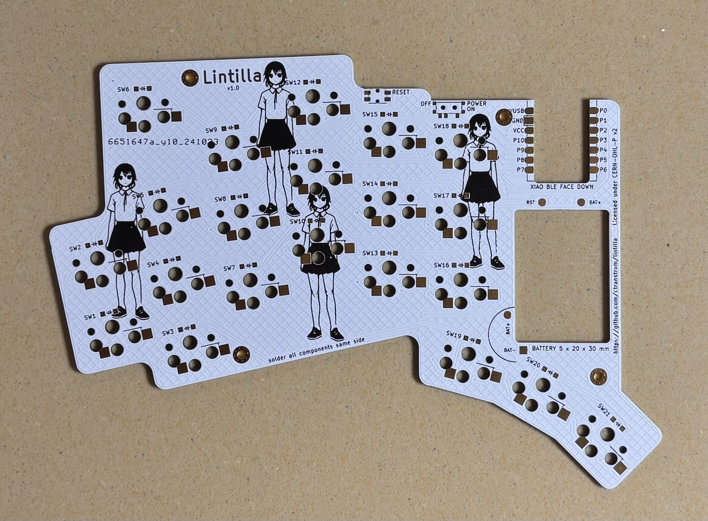
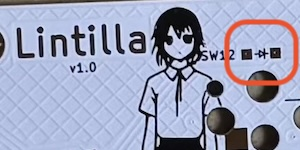
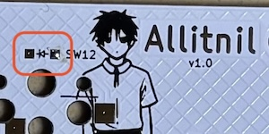
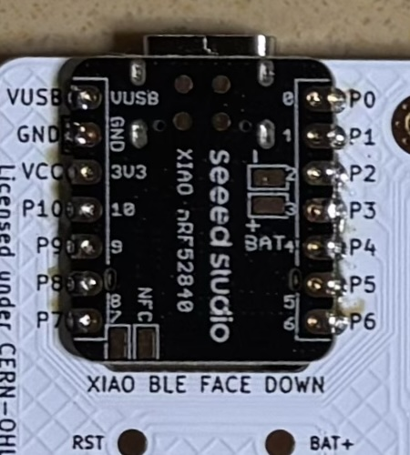
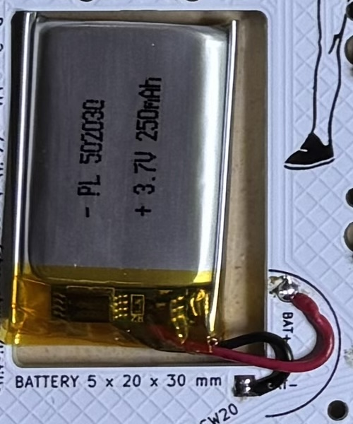

# Lintilla Build Guide

If this is your first time building a custom keyboard,
you should do two things before attempting this build.

- watch a few [soldering][how-to-solder] [tutorials][soldering101]
- read through a detailed build guide like
  the one for the [splitkb.com Aurora Series][splitkb-build-guide]

The remainder of this build guide will assume a basic familiarity with the process
and will only hit upon specific items that may be different or important to note while
building the Lintilla.

## Useful equipment

You should ideally have access to:

- a [soldering iron][pinecil]
- some [good quality solder][kester]
- a decent hands-free magnifying glass
- precision tweezers

## All components are soldered on the same side of the board

Unlike many other custom keyboards, the Lintilla is designed so that all components are
soldered on the **bottom** of the circuit board. This makes the top of the board as low profile
as possible and makes it easy to know where each component goes.

While the PCB is reversible for the lowest cost manufacturing,
the silkscreen on the top of the board is different from the bottom,
so that when you are soldering components on the side labeled "Lintilla"
you are working on the right half of the keyboard,
and when you are soldering components on the side labeled "Allitnil"
you are working on the left half of the keyboard.

| Lintilla (right half)                | Allitnil (left half)                 |
| ------------------------------------ | ------------------------------------ |
|  |  |

## Diodes only work one direction

Start with the diodes. Note that diodes only work in one direction,
so it's important that you align the line on the diode with the silkscreen line
on the PCB. It can sometimes be hard to see the line on the diode, so you may have
to look at it under a magnifying glass and/or with the light striking the diode at
an angle to see it well.

All the diodes are oriented the same way on each half of the PCB. That is to say,
when you are soldering on "Lintilla", all the lines on the diodes will be on the right,
and when you are soldering on "Allitnil", all the diode lines will be on the left.

| Lintilla diodes                                        | Lintilla diodes                                        |
| ------------------------------------------------------ | ------------------------------------------------------ |
|  |  |

To solder a surface mount diode, I find it easiest to first add a little solder to one
of the pads on the PCB, then using a pair of tweezers move the diode into position as I
reheat the solder, and then remove the soldering iron while still holding the diode in
position so the solder can cool. Once I am satisfied that the diode is correctly in
place and flat against the PCB, I then solder the other leg of the diode.

Note that for the case to fit properly, it is important that each diode be centered in
its position and flat against the board. If it is too far out of position or sitting at
an angle on the board, the case may not fit.

## Hotswap sockets also need to be aligned

Next step is the hotswap sockets. Although electrically, they will work even if installed
the wrong way, it is important to look at the line on the silkscreen and align the hotswap
socket so that the corner with the right angle is oriented to the line on the PCB.

In the following picture, the blue square on the on SW19 shows the silkscreen line before
a hotswap socket is installed, the green square on SW20 shows a hotswap socket in the
correct orientation where the silkscreen line is mostly hidden by the socket, and the red
square on SW21 shows an incorrectly oriented hotswap socket, where the silkscreen line is
clearly visible poking out around the edges of the socket.

To install a hotswap socket, set the socket into place in the PCB, double check the alignment, and
then heat one pad and feed solder into the hollow of the socket until it's pretty much filled up, noting that
the hotswap socket will take a **LOT** more solder than used for the diodes. You want to be sure to use plenty
of solder to allow for a strong bond to form, which will help provide strength to the socket for inserting and
removing the switches, while still taking care not to overflow the hollow. If you use too much solder that
spills out of the socket, the case will not fit correctly.

## Power switch and reset switch

The power and reset switches are very similar. The PCB has tiny holes to help with the alignment
of these switches, and just like with the SMD diodes, the trick is to start with a little solder
just one of the pads, then use tweezers to keep the switch in place and/or fix its alignment
while reheating the solder. Once one leg is firmly in place and the alignment is correct, you can
solder the remaining legs.

Note that the four legs on the left and right edges of the power switch are not electrically important; they
serve to provide strength to the switch to withstand the pressure of turning the switch on and off.
So if you accidentally join these legs together with solder, you don't need to try to remove the joining solder.

For the reset switch, however, it is important that the top and the bottom legs do not have a solder bridge.

Again note that while there is a little extra space around the pad for the solder, in order for the case to fit
correctly, it is important that you do not have too much extra solder going outside of each pad or above the switches.

Once you have soldered the power switch onto the board, make sure to leave it in the "OFF" position for the duration
of the soldering. Note that when the power switch is pushed toward the microcontroller, it is "ON"
and when it is pushed away, it is "OFF".

## Microcontroller

Now that all the other components are soldered to the board, it is time to address the microcontroller.

The board has been designed so that the majority of the height of the microcontroller is using the same vertical
space as the PCB itself, so it's a bit unconventional, but the microcontroller needs to be soldered upside down to the board.

The alignment of the microcontroller is a little tricky.
There are lines on the PCB where the XIAO edges should go,
but getting it to stay in place while soldering it is a bit of a challenge.
My technique is similar to that of a diode:
put a little solder on one of the corner pads of the PCB,
and use tweezers or a finger (far from the heat of the soldering iron!)
to steady the board while reheating the solder.
I usually have to do this three or four times to get the board perfectly aligned.
While there is a little leeway on an exact fit,
you should take care to get it as close as possible.
The top edge of the XIAO should be even with the edge of the PCB,
and along both sides of the XIAO you should be able to see an equal amount of each pad sticking out.

Once one corner is soldered and the alignment is looking good, solder the other corner to firmly fix it in place,
and then solder each remaining pad one by one. Take care not to allow the solder to spill out of the side of the pad
or above the XIAO, but you should be able to see solder coating the bottom of the pad through each hole in the XIAO.

## Battery

Now for my least favorite part. First double check that the switch is in the "OFF" position.
Place the battery into the battery cutout with its wires pointing toward the semicircle
in the silkscreen. That semicircle indicates the amount of room available for the wires.

You will need to cut, strip, and solder the battery wires to the board. When cutting the battery wires:

- cut and solder one at a time (you do not want the wires to touch or you will destroy the battery)
- put electrical tape over the wire you aren't working on, just for extra good measure
- leave enough length to get a little bend in the wire, but not so much that the wire goes outside the semicircle, as shown in the picture
- keep the remaining wire after it's cut; you'll use it on the next step
- make sure to solder the red wire to BAT+ and the black wire to BAT-

Then, with the remaining wire from the battery, connect the pads on the underside of the XIAO to the pads on the PCB.

Both the XIAO and the PCB have a silkscreen for the BAT+ wire. However, the XIAO does not have any mark for the RST pad.

The reset pad on the XIAO is the lower right pad of the four circular pads near the USB port.

When connecting these wires, try to go straight up from the PCB onto the back of the XIAO before going left or right.
The bluetooth antenna is located in the lower middle section of the XIAO,
and a wire there could slightly interfere with the bluetooth signal.

Also note that the XIAO BAT+ and BAT- pads are **really** close together, and you don't want to bridge these,
so be extra careful when soldering the BAT+ pad, and don't turn the power switch back on until you are certain
you haven't inadvertently connected these two pads.

[how-to-solder]: https://www.google.com/search?q=youtube+how+to+solder
[kester]: https://typeractive.xyz/products/kester-solder-wire-tube
[pinecil]: https://typeractive.xyz/products/pinecil
[soldering101]: https://www.google.com/search?q=youtube+soldering+101
[splitkb-build-guide]: https://docs.splitkb.com/product-guides/aurora-series/build-guide
