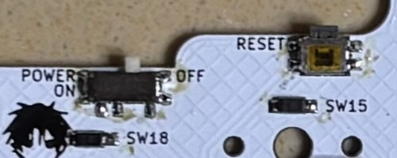
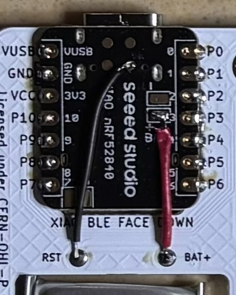
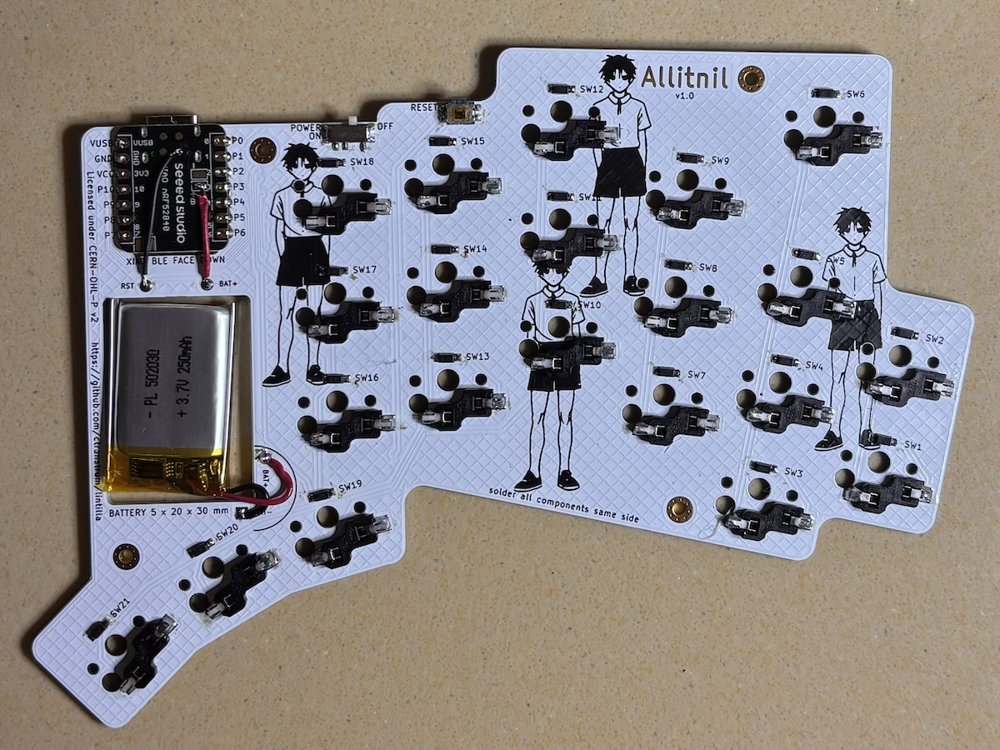
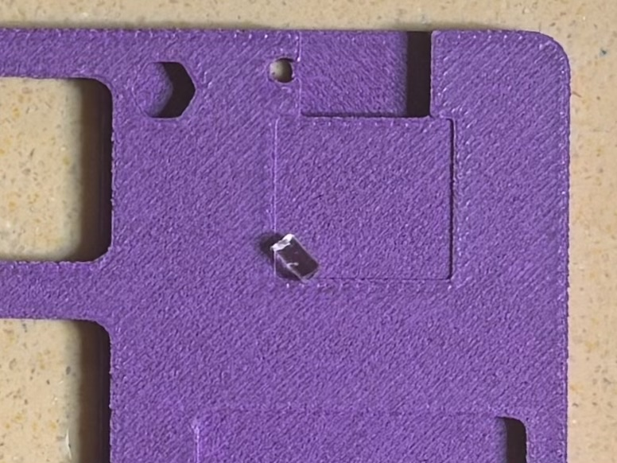
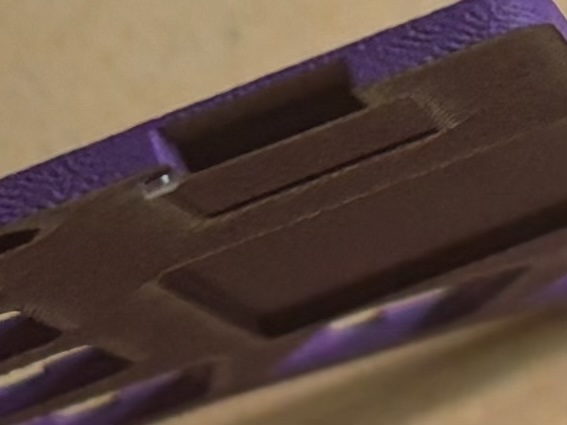
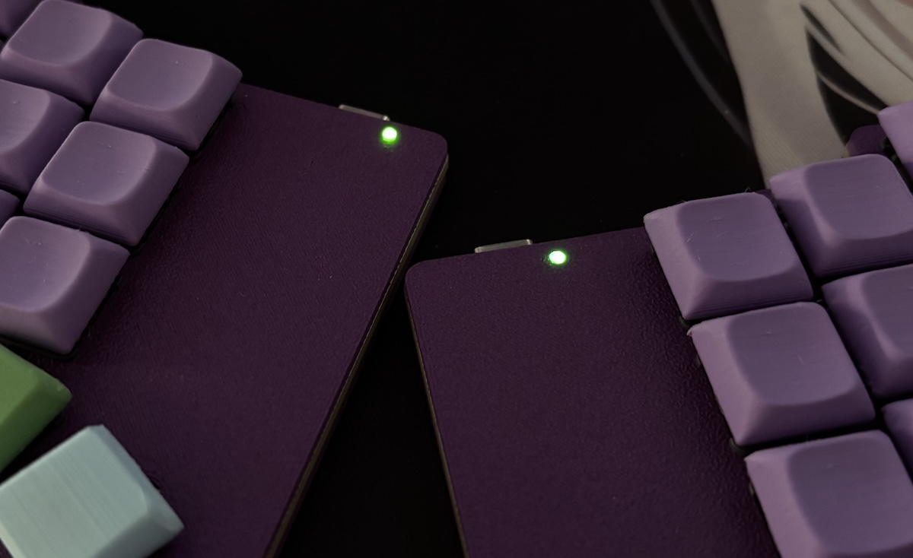
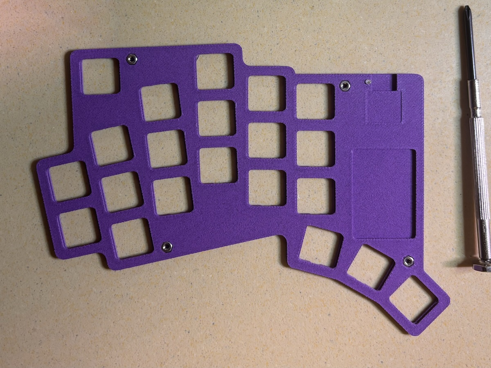
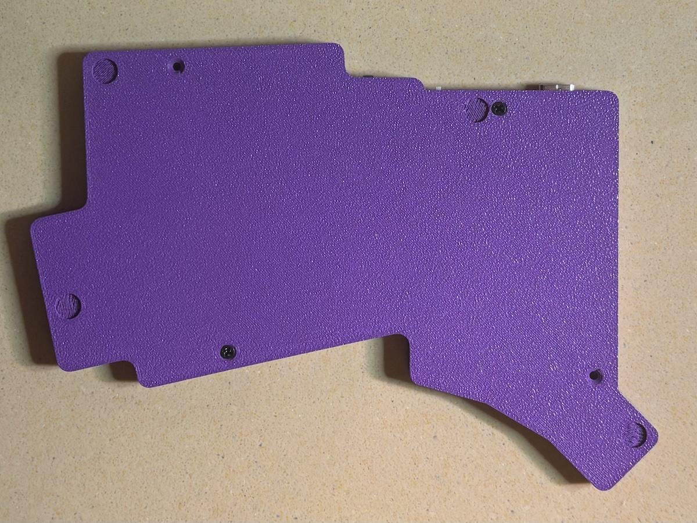
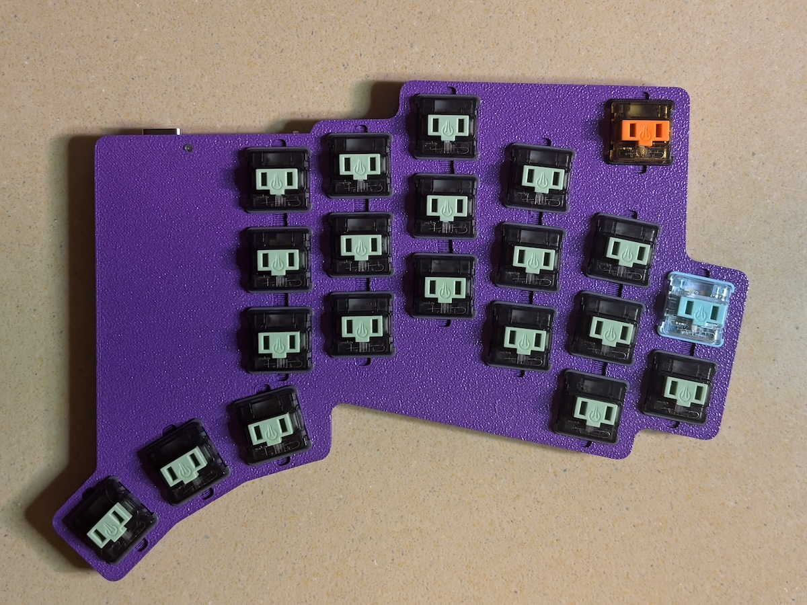
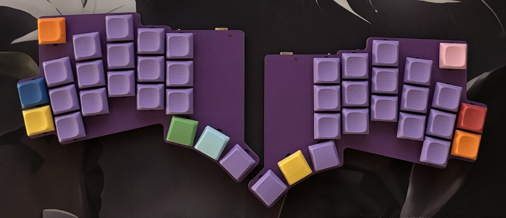

# Lintilla Build Guide

If this is your first time building a custom keyboard,
you should do two things before attempting this build.

- watch a few [soldering][how-to-solder] [tutorials][soldering101]
- read through a detailed build guide like
  the one for the [splitkb.com Aurora Series][splitkb-build-guide]

The remainder of this build guide will assume a basic familiarity with the process
and will only hit upon specific items that may be different or important to note while
building the Lintilla.

## Useful equipment

You should ideally have access to:

- a [soldering iron][pinecil]
- some [good quality solder][kester]
- a decent hands-free magnifying glass
- precision tweezers

## Getting the PCB

The PCB can be easily ordered from a circuit board manufacturer with an online store.
I used [JLC][jlcpcb] because--at least at the time of my order--their prices are unbeatable.

To order, you can simply upload the [gerber zip file][gerber] to their website,
accept all of the defaults, and wait a week or two for the boards to arrive.

Since the PCB is reversible, in theory you could order just two of them, and you'd be able
to build a complete keyboard. However, the minimum order at JLC is 5 copies, so you'll likely end up
with enough PCBs to complete two and a half keyboards. I don't really have any advice for what to do with
half a keyboard, but if you make two keyboards, you could give one to a friend!

A few items that you may want to customize:

- the color of the board; I printed mine in white, but whatever color you pick, the edges of the PCB will still be a little greenish
- you can choose to hide the JLC order number, or place it on the board where I've included the required order number string
- HASL can be lead-free if you are also using lead-free solder, or you can splurge for ENIG, but it's definitely not required

## Printing the case

If you don't have access to a 3D printer, you can also print your case at [JLC][jlc3dp].
I've had complicated boards printed in "Imagine Black" resin before, and been very impressed with the results.

However, I designed this case to be easy to print yourself on an FDM printer at home.
I printed mine using PLA, but you may want to consider PETG if you are planning to travel with
the keyboard and may at some point leave it in a hot car.

The case comes in [four separate files][case], a top and bottom for each half.

There are a few spots on the case where there is a small overhang that could cause problems on an untuned printer.
This is for the bumpon indentations on the bottom of the case, and for the switch-puller access on the top of the case.
I chose to enable supports for these sections, and had to gently remove the extra support material after each print,
but I felt like the print had higher quality this way.

## Soldering the components to the PCB

Once you've got your PCB and your components in hand, the exciting part of building can begin!

### All components are soldered on the same side of the board

Unlike many other custom keyboards, the Lintilla is designed so that all components are
soldered on the **bottom** of the circuit board. This makes the top of the board as low profile
as possible and makes it easy to know where each component goes.

While the PCB is reversible for the lowest cost manufacturing,
the silkscreen on the top of the board is different from the bottom,
so that when you are soldering components on the side labeled "Lintilla"
you are working on the right half of the keyboard,
and when you are soldering components on the side labeled "Allitnil"
you are working on the left half of the keyboard.

| Lintilla (right half)                | Allitnil (left half)                 |
| ------------------------------------ | ------------------------------------ |
|  |  |

### Diodes only work one direction

Start with the diodes. Note that diodes only work in one direction,
so it's important that you align the line on the diode with the silkscreen line
on the PCB. It can sometimes be hard to see the line on the diode, so you may have
to look at it under a magnifying glass and/or with the light striking the diode at
an angle to see it well.

All the diodes are oriented the same way on each half of the PCB. That is to say,
when you are soldering on "Lintilla", all the lines on the diodes will be on the right,
and when you are soldering on "Allitnil", all the diode lines will be on the left.

| Lintilla diodes                                        | Allitnil diodes                                        |
| ------------------------------------------------------ | ------------------------------------------------------ |
|  |  |

To solder a surface mount diode, I find it easiest to first add a little solder to one
of the pads on the PCB, then using a pair of tweezers move the diode into position as I
reheat the solder, and then remove the soldering iron while still holding the diode in
position so the solder can cool. Once I am satisfied that the diode is correctly in
place and flat against the PCB, I then solder the other leg of the diode.

Note that for the case to fit properly, it is important that each diode be centered in
its position and flat against the board. If it is too far out of position or sitting at
an angle on the board, the case may not fit.

### Hotswap sockets also need to be aligned

Next step is the hotswap sockets. Although electrically, they will work even if installed
the wrong way, it is important to look at the line on the silkscreen and align the hotswap
socket so that the corner with the right angle is oriented to the line on the PCB.

In the following picture, the blue square on SW19 shows the silkscreen line before
a hotswap socket is installed, the green square on SW20 shows a hotswap socket in the
correct orientation where the silkscreen line is mostly hidden by the straight lines of
the top edge of the socket, and the red square on SW21 shows an incorrectly oriented
hotswap socket, where the silkscreen line is clearly visible poking out around the
angled edges of the socket.

To install a hotswap socket, set the socket into place in the PCB, double check the alignment, and
then heat one pad and feed solder into the hollow of the socket until it's pretty much filled up, noting that
the hotswap socket will take a **LOT** more solder than used for the diodes. Repeat for the other leg.
You want to be sure to use plenty of solder to allow for a strong bond to form,
which will help provide strength to the socket for inserting and removing the switches,
while still taking care not to overflow the hollow. If you use too much solder that
spills out of the socket, the case will not fit correctly.

### Power switch and reset switch

The power and reset switches are very similar. The PCB has tiny holes to help with the alignment
of these switches, and just like with the SMD diodes, the trick is to start with a little solder
on one of the pads, then use tweezers to keep the switch in place and/or fix its alignment
while reheating the solder. Once one leg is firmly in place and the alignment is correct, you can
solder the remaining legs.

Note that the four legs on the left and right edges of the power switch are not electrically important; they
serve to provide strength to the switch to withstand the pressure of turning the switch on and off.
So if you accidentally join these legs together with solder, you don't need to try to remove the joining solder.

For the reset switch, however, it is important that the top and the bottom legs do not have a solder bridge.

Again note that while there is a little extra space around the pad for the solder, in order for the case to fit
correctly, it is important that you do not have too much extra solder going outside of each pad or above the switches.

Once you have soldered the power switch onto the board, make sure to leave it in the "OFF" position for the duration
of the soldering. Note that when the power switch is pushed toward the microcontroller, it is "ON"
and when it is pushed away, it is "OFF".

### Microcontroller

Now that all the other components are soldered to the board, it is time to address the microcontroller.

The board has been designed so that the majority of the height of the microcontroller is using the same vertical
space as the PCB itself, so it's a bit unconventional, but the microcontroller needs to be soldered upside down to the board.

Note that the height of the components on the XIAO is higher than the thickness of the PCB,
so in order for the XIAO to lay flat during the soldering process, the PCB will need to be placed on something flat
with the place where the XIAO sits extended off over the edge so that there is room for the XIAO.
I used some of the extra PCBs for this, simply stacking two spare PCBs below the one I was soldering.

The alignment of the microcontroller is a little tricky.
There are lines on the PCB where the XIAO edges should go,
but getting it to stay in place while soldering it is a bit of a challenge.
My technique is similar to that of a diode:
put a little solder on one of the corner pads of the PCB,
and use tweezers or a finger (far from the heat of the soldering iron!)
to steady the board while reheating the solder.
I usually have to do this three or four times to get the board perfectly aligned.
While there is a little leeway on an exact fit,
you should take care to get it as close as possible.
The top edge of the XIAO should be even with the edge of the PCB,
and along both sides of the XIAO you should be able to see an equal amount of each pad sticking out.

Once one corner is soldered and the alignment is looking good,
solder the opposite corner to firmly fix it in place,
and then solder each remaining pad one by one,
placing the tip of the soldering iron on the visible portion of
the PCB pad and against the side of the XIAO's castellated pad.
Take care not to allow the solder to spill out of the side of the pad or above the XIAO,
but you should be able to see solder coating the bottom of the pad through each hole in the XIAO,
and it's okay if that solder fills up some of each hole as well.

### Battery

Now for my least favorite part. First double check that the switch is in the "OFF" position.
Place the battery into the battery cutout with its wires pointing toward the semicircle
in the silkscreen. That semicircle indicates the amount of room available for the wires.

You will need to cut, strip, and solder the battery wires to the board. When cutting the battery wires:

- cut and solder one at a time (you do not want the exposed portion of the wires to touch or you will destroy the battery)
- put electrical tape over any exposed wire you aren't working on, for extra precaution
- leave enough length to get a little bend in the wire, but not so much that the wire goes outside the semicircle, as shown in the picture
- keep the remaining wire after it's cut; you'll use it on the next step
- make sure to solder the red wire to BAT+ and the black wire to BAT-

Then, with the remaining wire that was cut from the battery,
connect the pads on the underside of the XIAO to the pads on the PCB.

Be very careful to cut these wires to the exact length needed.
You don't want them too long. And too short is also obviously not going to work.
I speak from experience here.

Both the XIAO and the PCB have a silkscreen for the BAT+ wire. However, the XIAO does not have any mark for the RST pad.

The reset pad on the XIAO is the lower right pad of the four circular pads near the USB port.

When connecting these wires, try to go straight up from the PCB onto the back of the XIAO before going left or right.
The bluetooth antenna is located in the lower middle section of the XIAO,
and a wire there could slightly interfere with the bluetooth signal.

Also note that the XIAO BAT+ and BAT- pads are **really** close together, and you don't want to bridge these,
so be extra careful when soldering the BAT+ pad, and don't turn the power switch back on until you are certain
you haven't inadvertently connected these two pads.

### Clean the flux

Now that all the components are soldered onto the board and the battery is connected, take a moment to admire your work,
then clean the flux from the board using an old toothbrush and some isopropyl alcohol. It doesn't have to be perfect.

Also take a moment to examine each solder joint
to ensure that you don't have extra blobs of solder
that might interfere with the case.

If you do, you can remove these with a clean soldering iron and a little soldering wick.

Flip the board over and make sure no solder sneaked through any of the vias.
If it did, a moment with a hot iron can clean these up as well.

## Assemble the PCB into the case

Now it's time to put the case together! You're almost there!

### Slide the "fiber optic" light guide in place

Take the section of translucent printer filament and slice a tiny section about 2.5 to 3mm in length.
This can be hard to do because it's so tiny and it will try to fly away and hide in the carpet or behind a bookshelf.
I speak from experience.

Once you have this piece cut (and you still know where it is), use a pair of tweezers to coax it into the hole in the top case.

It should extend out a little bit below the case, and if it pokes out a bit above the case as well, that's okay, too.
When the case is fully assembled, you can push down gently on it to get it as low as possible.
On my board, it sticks up about a quarter of a millimeter, and that allows the light to be very visible.

### Use the nuts and screws to assemble the case to the PCB

Place the four nuts into the cutouts in the top case.

Then place the PCB onto the case, components facing away from the top case, and align the edges.
The xiao and the battery should slide easily into the hollows prepared for them and help with alignment.
Put the bottom case on top, and use four screws to secure it to the PCB.

At this point, the bottom of the case is attached to the PCB,
but the top of the case is only held in place by the pressure
of the slight twisting of the nuts as you attached the screws,
and it may be possible for it to be removed at this point.

Flip the case over. If the top comes off, simply put it back in place.

### Insert the switches and keycaps

Then insert the switches. The switches actually attach to the PCB rather than the top case,
so the switches will serve as the "screws" to keep the top plate attached.

Take care when inserting the switches that the pins of each switch are straight.
Gently place the switch in place, and position it so it is aligned before pushing it
straight down. Do not try to assemble it at an angle. It may take a bit of force to get the
switch fully seated. There should be no gap between the skirt of the switch and the top plate.

Attach the keycaps. Again, try to first align the keycap and then use firm even pressure.

### Attach the bumpons

Once everything else is installed, flip the keyboard back over and press each bumpon into place
in its designated spot. Your keyboard is now ready for firmware.

## Firmware installation

You can grab the default firmware from the [firmware repository][firmware].

To install it, attach each half one at a time to the computer by USB, double-tap the reset button,
and then drag the firmware for that half to the device that appears as a thumb drive.

Note, however, that the "thumb drive" is not actually a real thumb drive, and normal copy and paste operations
do not work as they do on a real thumb drive. Copying the file to the keyboard is really a command to the
microcontroller to install firmware. As soon as the firmware is installed, the keyboard will reboot and start
running the new firmware. This will make the "thumb drive" immediately disconnect from the computer, which
is often seen as an error by the operating system.

But you are free to ignore that error and just start using the keyboard. Just don't try to copy anything that's
not a firmware to the keyboard, and you should be fine.

## Problems?

For more information about using [ZMK][zmk], including how to use [ZMK Studio][zmkstudio],
or how to configure your own [zmk repo][zmkrepo], please refer to the [ZMK docs][zmkdocs].

If you still have the default keymap installed and want to update the layout with [ZMK Studio][zmkstudio],
the "ZMK Studio unlock" key combination is accessed by two keys on the right half of the keyboard:
hold down the extra key on the top right side (mapped by default as the MUTE key)
and then press the middle thumb key (mapped by default as the SPACE key).
Note that you will need to be using Chrome or Edge to get it to work.

If a key isn't working, the first thing to look at is that the switch has been installed properly,
and the pins aren't bent.

If you need to correct any soldering,
access to the bottom of the PCB is as simple as removing the four screws on the case.
You do not necessarily need to remove all the switches.
However, if you are doing extensive re-soldering work,
it may be a good idea to fully remove the PCB from the case.

One unexpected feature of the XIAO microcontroller is that the power switch must be "ON"
in order for the battery to charge while plugged into a USB-C cable.
Remember: sliding the power switch toward the USB port turns the keyboard on,
while sliding it away from the USB port turns it off.

[case]: cases/
[firmware]: https://github.com/ctranstrum/lintilla/tree/zmk
[gerber]: pcb/lintilla-gerbers.zip
[how-to-solder]: https://www.google.com/search?q=youtube+how+to+solder
[jlc3dp]: https://jlc3dp.com/
[jlcpcb]: https://jlcpcb.com/
[kester]: https://typeractive.xyz/products/kester-solder-wire-tube
[pinecil]: https://typeractive.xyz/products/pinecil
[soldering101]: https://www.google.com/search?q=youtube+soldering+101
[splitkb-build-guide]: https://docs.splitkb.com/product-guides/aurora-series/build-guide
[zmk]: https://zmk.dev/
[zmkdocs]: https://zmk.dev/docs
[zmkrepo]: https://zmk.dev/docs/user-setup
[zmkstudio]: https://zmk.studio/
